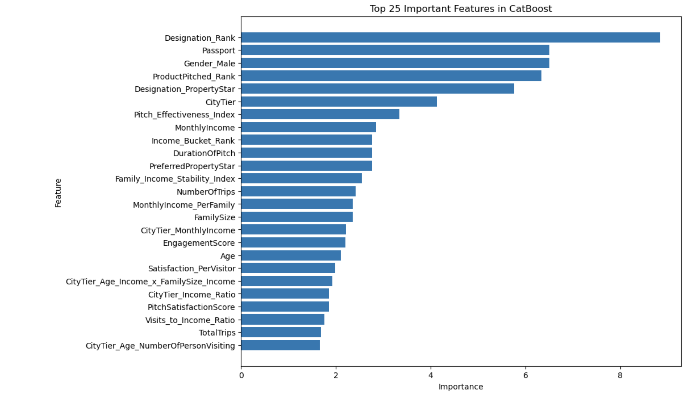

# SignateCup_2024
概要
本プロジェクトは、SignateCup 2024において旅行会社の保有する顧客データを用い、旅行パッケージの成約率を予測するモデルの構築を目的としています。コンペティションの参加を通じて、データサイエンスにおける前処理、特徴量エンジニアリング、モデリングの一連のプロセスを実践しました。本リポジトリでは、その全ての作業内容を共有しています。

## データの前処理
#### 欠損値の処理: 
データセット内の欠損値を分析し、適切な手法で補完または削除を行いました。
#### ノイズの修正: 
データの異常値やノイズを検出し、ロバストな分析が可能なように修正を加えました。
#### 異常値の検出と修正: 
異常値を検出し、トレンドから逸脱するデータポイントを修正することで、モデルの精度を向上させました。

## 特徴量エンジニアリング
新しい特徴量の作成: 顧客の属性や接触履歴を基に、目的変数との関連性が高いと考えられる新しい特徴量を作成しました。例えば、訪問回数に基づく顧客の関心度や、家族構成に関連する特徴量などを考案しました。

### 目的変数を使用した特徴量の試行: 
初期段階では目的変数を用いた特徴量を作成しましたが、データリークの可能性が示唆されたため、これらの特徴量は削除しています。

### エンコーディングとスケーリング: 
カテゴリカルデータに対してホットエンコーディングを行い、全ての数値データをスケーリングしました。これにより、モデルの学習効率を高めました。

## クラス不均衡への対応
このデータセットは、成約に至る顧客（クラス1）が少ない不均衡データセットでした。そのため、以下の手法を用いてクラス不均衡を補正しました。

#### SMOTE: 
クラス1のデータを合成することで、クラスバランスを改善しました。ただし、このアプローチでは十分な精度が得られませんでした。

#### Stratify: 
トレーニングデータとテストデータにおいて、クラスの割合を維持するためにstratify=yを設定しましたが、期待するほどの改善は見られませんでした。

## モデル構築と評価
以下の機械学習モデルを用いて成約率の予測を行いました。各モデルについて、ハイパーパラメータの調整や交差検証を行い、最適なパフォーマンスを引き出すよう努めました。

- RandomForest
- CatBoost
- XGBoost
- Gradient Boost
- Logistic Regression
- LightGBM
- SVC

## 特徴量の重要性と選択
モデルの性能を最大限に引き出すため、各モデルがどの特徴量を重要視しているかを可視化し、特徴量選択の指針としました。
以下は、特に優れたパフォーマンスを示したCatBoostモデルにおける上位25の重要な特徴量を示しています。

この可視化から、特定の特徴量がモデルの予測においてどれほど重要であるかが分かります。
例えば、「Designation_Rank」や「Passport」、「Gender_Male」などが高い重要度を持つことが確認され、これらの特徴量が成約率の予測に強く寄与していることがわかります。

特徴量の重要性を考慮しながら、データセットの次元を削減し、より効率的で解釈可能なモデルを構築しました。
これにより、モデルの精度向上と解釈性の向上を両立させることができました。

## モデルのパフォーマンスと最適化
今回のプロジェクトにおいて、特に優れたパフォーマンスを示したモデルはCatBoostとGradient Boostingでした。
これらのモデルは、データの複雑なパターンを効果的に捉え、予測精度を向上させることに成功しました。

さらに、データセットのクラス不均衡に対応するために、class_weightパラメータを活用しました。
この調整により、少数クラスの重要性を考慮しながらモデルを訓練することが可能となり、モデルのバランスと予測精度を一層強化しました。

これらの最適化により、モデルはターゲットクラスに対するバイアスを軽減し、全体としてより堅牢な予測性能を達成しています。
特に、クラス間のバランスが取れた予測が求められる実世界の問題において、このアプローチは非常に有効であることが確認されました。

## AUCスコア
各モデルのパフォーマンスを比較し、最も精度の高いモデルとしてXGBoostを選定しました。最終的に、ベストなモデルで得られたAUCスコアは 0.8236439 (暫定) です。

## 結果と今後の展望
今回のコンペティションでは、複数のアプローチを試行しましたが、クラス不均衡の問題や特徴量選定においてさらなる改善の余地があると感じました。
今後の課題としては、さらに高度な特徴量エンジニアリングや、異なるモデルのアンサンブルを活用した精度向上が考えられます。
また、業務での実務的な応用を意識し、より汎用性の高いモデルの開発を目指していきたいと思います。

## お問い合わせ
このリポジトリやプロジェクトに関するご質問やご意見がございましたら、お気軽にご連絡ください。
kazuehayakawa@gmail.com

